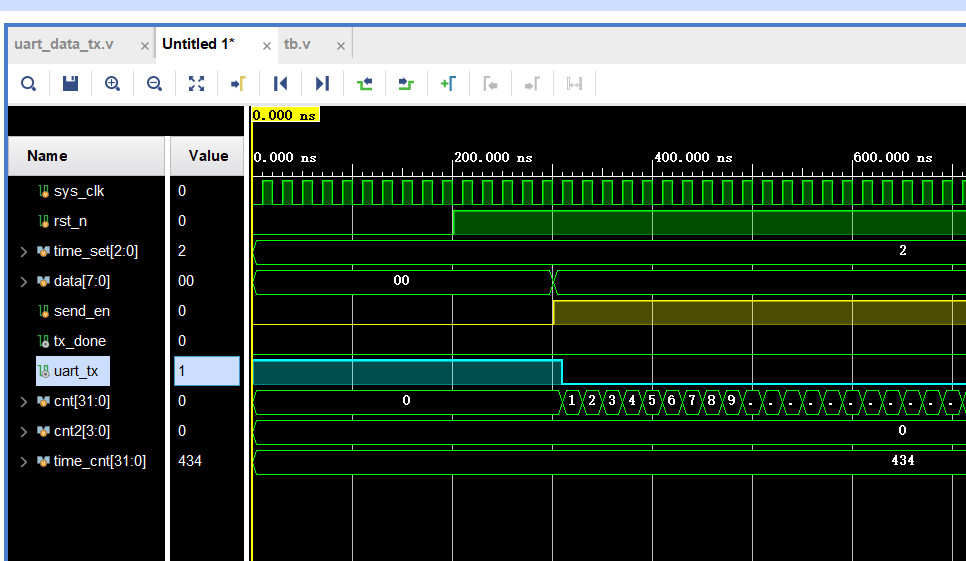

# 一、我想做串口发送8bit数据，以start开始、stop结束，中间夹着要传输的8bit数据
## 1. 串口整个流程的叙述
                         
input sys_clk         ,          
input rst_n           ,          
input [2:0] time_set  ,        
input [7:0] data      ,          
input send_en         ,          
output reg uart_tx    ,          
output reg tx_done  
    
reg [31:0] cnt;//基本计数器
reg [3:0] cnt2;//2级定时器 
reg [31:0] time_cnt;

首先，晶振带动时钟，时钟开始以20ns的节奏循环往复地跳动；在时钟的指挥下，rst_n复位信号也开始在一定的时间后拉高。一旦rst_n拉高，cnt、cnt2、send_en、tx_done就要开始分别执行各自的工作了。cnt初始值为0；cnt2初始值也为0，cnt2为零对应的程序是要发送start信号。同时，cnt从零开始+1，直到加到434，cnt清零并且导致cnt2进位变为1，执行发送data[0]的程序、继续：cnt又从零开始+1，直到加到434，cnt又清零并且导致cnt2进位变为:2，执行发送data[1]的程序......cnt又从零开始+1，直到加到434，cnt又清零并且导致cnt2进位变为8，执行发送data[7]的程序.终于发送完8bit了。接下来，cnt继续从零开始+1，直到加到434，cnt再次清零并且导致cnt2进位变为:9，执行发送stop的程序，直到cnt从0记到433，这一个拍子的时间，都在发送stop，并且在stop维持的最后一个cnt等于433的时刻，tx_done拉高。tx_done拉高的同时，send_en立马拉低（因为是异步时钟，可以同步实现）。直到下一次send_en拉高的时刻出现，tx_done再次同时拉低。而cnt2已经在==10的时候清零了。


														   ||
															
															v
															
															V


## 2. 


cc

nn
# 二、代码
## 1. 设计代码
```
module uart_data_tx(                           
input sys_clk         ,          
input rst_n           ,          
input [2:0] time_set  ,   //基础计数器的设置       
input [7:0] data      ,          
input send_en         ,          
output reg uart_tx    ,          
output reg tx_done  
    );
/*-----------------------变量的声明-----------------------------*/
reg [31:0] cnt;//基本计数器
reg [3:0] cnt2;//2级定时器 
reg [31:0] time_cnt;

/*-----------------------设置时间间隔-----------------------------*/ 
always@(*)
if(!rst_n)
    time_cnt<=4800;
else 
    case(time_set)  
        0:time_cnt<=10416;                 //4800; 
        1:time_cnt<=5208;                  //9600; 
        2:time_cnt<=434;                   //115200;
        default:time_cnt<=434;             //115200;
    endcase
/*-----------------------基本计数器-----------------------------*/
always@(posedge sys_clk or negedge rst_n)
if(!rst_n)
    cnt<=32'd0;
else if(send_en)
    if(cnt==time_cnt-1)
        cnt<=32'd0;
    else
        cnt<=cnt+1;
else//!send_en
    cnt<=32'd0;     
/*-----------------------2级计数器-----------------------------*/
always@(posedge sys_clk or negedge rst_n)
if(!rst_n)
    cnt2<=4'd0;//默认发start位
else if(send_en)begin
    if((cnt2>=0)&&(cnt2<10))begin
        if(cnt==time_cnt-1)
            cnt2<=cnt2+1;
        else  
            cnt2<=cnt2;
     end
     else if(cnt2==10)
        cnt2<=0;//cnt2的清零
     else  
            cnt2<=cnt2;
end
else //!send_en
    cnt2<=4'd0;
/*-----------------------uart_tx-----------------------------*/
always@(posedge sys_clk or negedge rst_n)
if(!rst_n)
    uart_tx<=0;
else if(send_en)
    case(cnt2)
        0: begin uart_tx<=0;  end                        
        1:  uart_tx<=data[0] ;                  
        2:  uart_tx<=data[1] ;                  
        3:  uart_tx<=data[2] ;                  
        4:  uart_tx<=data[3] ;                  
        5:  uart_tx<=data[4] ;                  
        6:  uart_tx<=data[5] ;                  
        7:  uart_tx<=data[6] ;                  
        8:  uart_tx<=data[7] ;                  
        9:  uart_tx<=1 ;      
        default: uart_tx<=1;    
      endcase                                
else//!send_en
    uart_tx<=uart_tx;
/*-----------------------tx_done-----------------------------*/
always@(posedge sys_clk or negedge rst_n)
if(!rst_n)
    tx_done<=0;
else if((cnt2==9) && (cnt==time_cnt-1))                                    
        tx_done<=1;     
else if(send_en)
        tx_done<=0;                
else
        tx_done<=tx_done;
endmodule                                         

```

## 2. 仿真代码
```
`timescale 1ns / 1ps
module tb;
reg sys_clk            ;
reg rst_n              ;
reg [2:0] time_set    ;
reg [7:0]  data        ;
reg send_en            ;
wire uart_tx           ;
wire tx_done           ;
/*---------------------------例化-------------------------*/
uart_data_tx u1(
       .sys_clk    (sys_clk)           ,
       .rst_n      (rst_n  )           ,
       .time_set   (time_set)          ,
       .data       (data   )           ,
       .send_en    (send_en)           ,
       .uart_tx    (uart_tx)           ,
       .tx_done    (tx_done)
    );
/*----------------------------时钟初始化------------------------------------*/
initial 
sys_clk=0;
always #10 sys_clk=~sys_clk;
/*----------------------------其余端口初始化-------------------*/
initial begin
rst_n   =0;  
time_set=2;  
data    =8'd0;  
send_en =0;
#201;
rst_n   =1;   
#100;
/*------- 1 次 -----*/
data=8'b0101_0101;
send_en=1;
@(posedge tx_done)
send_en=0;
/*------- 2 次 -----*/
#20000;
data=8'b0000_1111;
send_en=1;
@(posedge tx_done)
send_en=0;
/*------- 3 次 -----*/
#20000;
data=8'b1111_1111;
send_en=1;
@(posedge tx_done)
send_en=0;
//结尾
#20000;
send_en=1;
#20000;
$stop;
end
endmodule

```
## 3. 设计代码的思路
```
module uart_data_tx(                           
input sys_clk         ,          
input rst_n           ,          
input [2:0] time_set  ,   //基础计数器的设置       
input [7:0] data      ,          
input send_en         ,          
output reg uart_tx    ,          
output reg tx_done  
    );
```
***一些端口：***

==time_set== 是一个可以操控1010_1010每个bit之间时间间隔的端口；它的位宽是3位2进制数，可以表达0~8的10进制数。time_set=0、time_set=1......被赋予不同的值代表的含义：time_set=0代表每个bit的间隔时间是4800，time_set=1代表间隔时间是9600......。

【4800、9600、115200都是波特率，波特率是串口通信中用来描述传输速率的单位。波特率是4800，代表1s传输4800个bit，发送一个bit的时间就是1s/4800=1000_000_000ns/4800=208333ns。晶振的一个周期（一上一下）消耗20ns，那么208333就可以记10416个周期。相应的把9600、115200传一个bit消耗的周期算出来，分别是5208、434。】

因此time_set不同的值，可以操控波特率的变化，继而操控是打434个拍子传1bit，还是打5208个拍子传1bit。

==data== 是要传输的8bit数据位。在里面写我们想要传的数据。具体要在测试文件里面写入。

==send_en== 是使能信号。它拉高代表可以传数据；拉低代表停止传数据。

==uart_tx==：为什么会多出来这个东西是因为：data是8位的并行数据，串口通信的目的就是要把并行数据串行发出去，并行数据有了，要把并行数据的每一位传给uart_tx，让它在不同的时刻发出去，这就是串行发送。当然这个时间差就是波特率，虽说是分时刻传出去，但我们肉眼是无法捕捉到的，它很快。

==tx_done== 是发送完的标志信号，tx_done在数据发完之后拉高，其余时间拉低。拉高代表传输完成，send_en就要在tx_done拉高的同时拉低，停止传输数据。
```
/*-----------------------变量的声明-----------------------------*/
reg [31:0] cnt;//基本计数器
reg [3:0] cnt2;//2级定时器 
reg [31:0] time_cnt;
```
==cnt== 是1010_1010每个bit之间时间间隔的计数器
==cnt2== 是串口要发送的数据，一共10位：分别是起始位、8bit数据位、stop位。
==time_cnt== 是1010_1010每个bit之间时间间隔参数，由time_set端口来设置具体是多少。
```
/*-----------------------设置时间间隔-----------------------------*/ 
always@(*)
if(!rst_n)
    time_cnt<=4800;
else 
    case(time_set)  
        0:time_cnt<=10416;                 //4800; 
        1:time_cnt<=5208;                  //9600; 
        2:time_cnt<=434;                   //115200;
        default:time_cnt<=434;             //115200;
    endcase
```
 默认time_cnt是434个拍子（4800的波特率），time_set在tb文件被赋予不同的值，那么time_cnt就取不同的值。
 ```
/*-----------------------基本计数器-----------------------------*/
always@(posedge sys_clk or negedge rst_n)
if(!rst_n)
    cnt<=32'd0;
else if(send_en)
    if(cnt==time_cnt-1)
        cnt<=32'd0;
    else
        cnt<=cnt+1;
else//!send_en
    cnt<=32'd0;
```
cnt被分为send_en使能和失能两种情况，只有send_en使能（允许数据传输）的情况下cnt才能计数。     
```
/*-----------------------2级计数器-----------------------------*/
always@(posedge sys_clk or negedge rst_n)
if(!rst_n)
    cnt2<=4'd0;//默认发start位
else if(send_en)begin
    if((cnt2>=0)&&(cnt2<10))begin
        if(cnt==time_cnt-1)
            cnt2<=cnt2+1;
        else  
            cnt2<=cnt2;
     end
     else if(cnt2==10)
        cnt2<=0;//cnt2的清零
     else  
            cnt2<=cnt2;
end
else //!send_en
    cnt2<=4'd0;
```
cnt2也被分为send_en使能和失能两种情况，只有send_en使能的情况下cnt2才能计数，
记芯片传到第几个数据了，第0个、第1个、第2个......直到第9个停止位传完就不会继续传了。
```
/*-----------------------uart_tx-----------------------------*/
always@(posedge sys_clk or negedge rst_n)
if(!rst_n)
    uart_tx<=1;
else if(send_en)
    case(cnt2)
        0: begin uart_tx<=0;  end                        
        1:  uart_tx<=data[0] ;                  
        2:  uart_tx<=data[1] ;                  
        3:  uart_tx<=data[2] ;                  
        4:  uart_tx<=data[3] ;                  
        5:  uart_tx<=data[4] ;                  
        6:  uart_tx<=data[5] ;                  
        7:  uart_tx<=data[6] ;                  
        8:  uart_tx<=data[7] ;                  
        9:  uart_tx<=1 ;      
        default:uart_tx<=1;      
      endcase 
else//!send_en
    uart_tx<=uart_tx;  
   ```
 cnt2每加到一个数值，就会触发一行程序，这一行程序是uart_tx向芯片外传输的，
 默认uart_tx是高电平，只有在send_en拉高（允许发送数据）并且cnt2等于0的时候会触发低电平开始发送。
 所以send_en和uart_tx的关系如下图所示：
 
     
 ```
/*-----------------------tx_done-----------------------------*/
always@(posedge sys_clk or negedge rst_n)
if(!rst_n)
    tx_done<=0;
else if(cnt2==9 && cnt == time_cnt-1)                                    
        tx_done<=1;     
else if(send_en)
        tx_done<=0;                
else
        tx_done<=tx_done;
endmodule               
```
tx_done是串口发送完数据的一个标志信号，当信号发送完，它会拉高。send_en信号（发送使能）会拉低。
在“cnt2==9 && cnt == time_cnt-1”这个时刻拉高，也就是在stop位完全发送完之后再拉高；接下来的一个else if分支，代表只要send_en信号没来，tx_done就一直是高电平。

## 4. 仿真代码的思路
```
`timescale 1ns / 1ps
module tb;
reg sys_clk            ;
reg rst_n              ;
reg [2:0] time_set    ;
reg [7:0]  data        ;
reg send_en            ;
wire uart_tx           ;
wire tx_done           ;
/*---------------------------例化-------------------------*/
uart_data_tx u1(
       .sys_clk    (sys_clk)           ,
       .rst_n      (rst_n  )           ,
       .time_set   (time_set)          ,
       .data       (data   )           ,
       .send_en    (send_en)           ,
       .uart_tx    (uart_tx)           ,
       .tx_done    (tx_done)
    );
```
端口的例化

```
/*----------------------------时钟初始化------------------------------------*/
initial 
sys_clk=0;
always #10 sys_clk=~sys_clk;
/*----------------------------其余端口初始化-------------------*/
initial begin
rst_n   =0;  
time_set=2;  
data    =8'd0;  
send_en =0;
#201;
rst_n   =1; 
```
时钟和其余模块的初始化分开写，如果写到一个initial模块，首先不使用always关键字了，只能使用forever，（“forever”是不可综合语句）。而initial语句快中语句是顺序执行的，在某个时刻会出现，先执行完复位信号的拉高，再继续时钟的翻转；
```  
#100;
/*------- 1 次 -----*/
data=8'b0101_0101;
send_en=1;
@(posedge tx_done)
send_en=0;
/*------- 2 次 -----*/
#20000;
data=8'b0000_1111;
send_en=1;
@(posedge tx_done)
send_en=0;
/*------- 3 次 -----*/
#20000;
data=8'b1111_1111;
send_en=1;
@(posedge tx_done)
send_en=0;
```
测试文件里主要是进行激励信号的赋值。
data给三个不同的值，然后send_en拉高。一旦检测到tx_done的高电平，立即拉低send_en
```
//结尾
#20000;
send_en=1;
#20000;
```
这三句是为了可以更好地看到send_en以及tx_done这两个信号在最后发送完之后的变化
$stop;//执行到这里，自动停止运行程序。
end
endmodule


# 三、